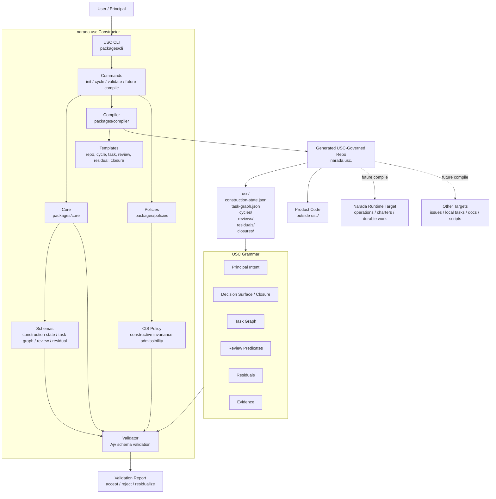
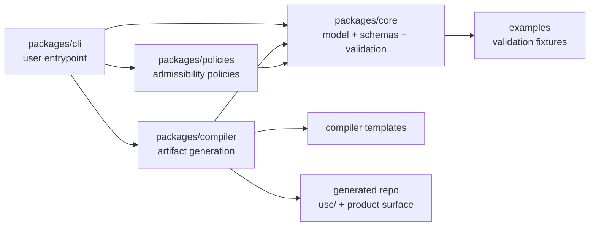
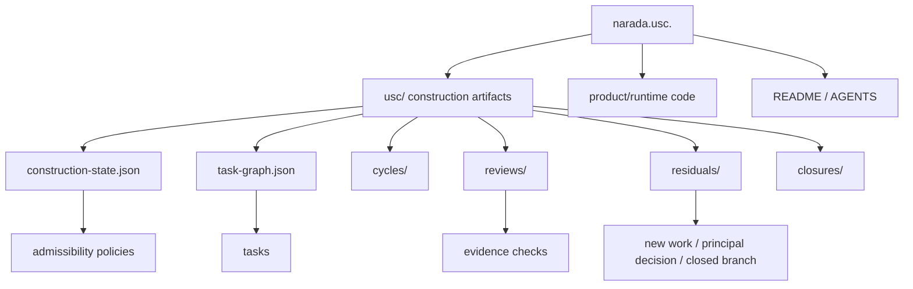
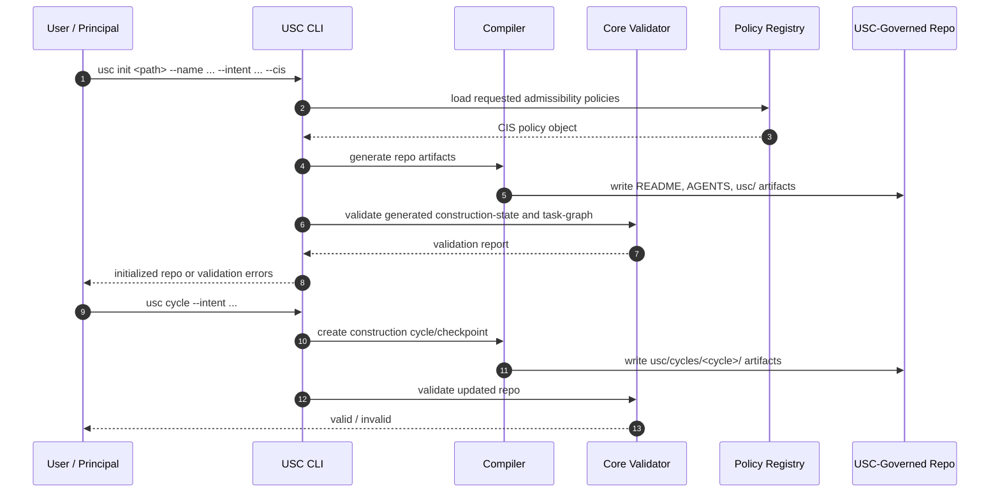
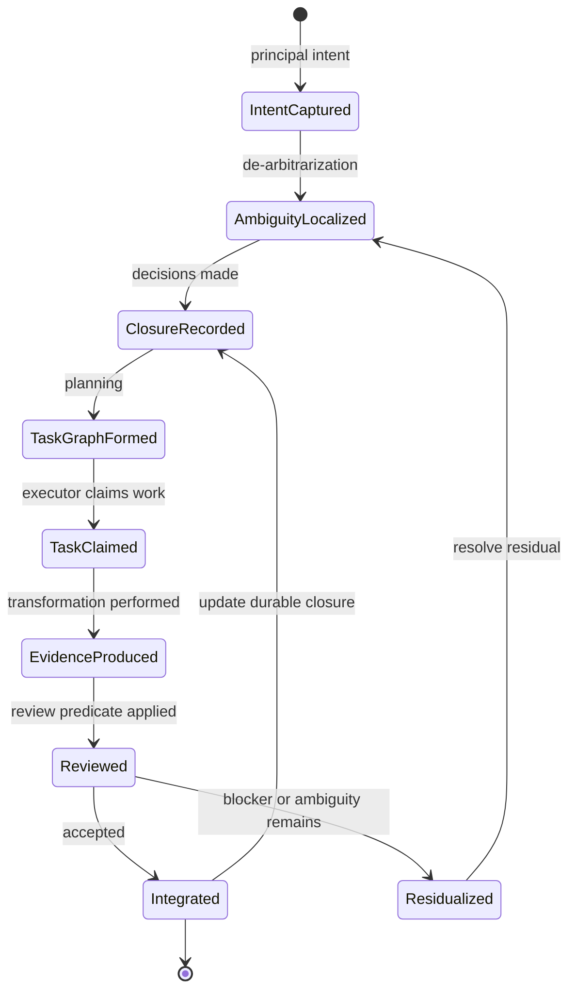
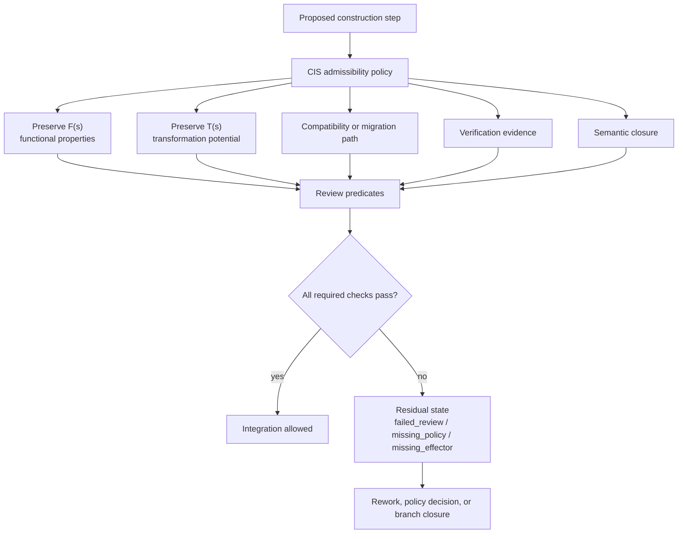
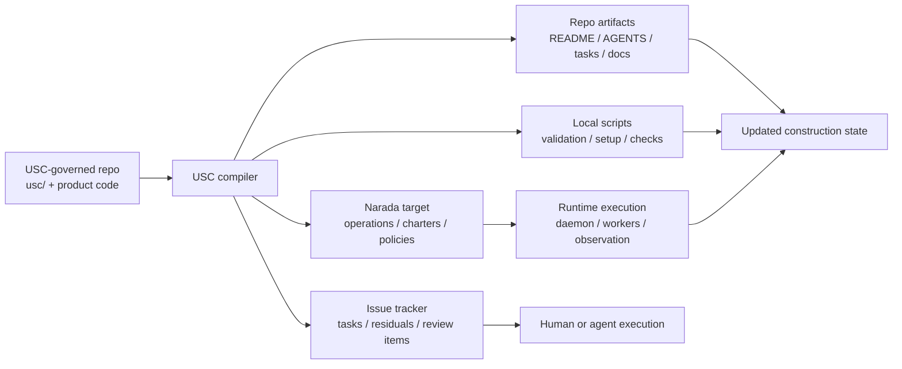
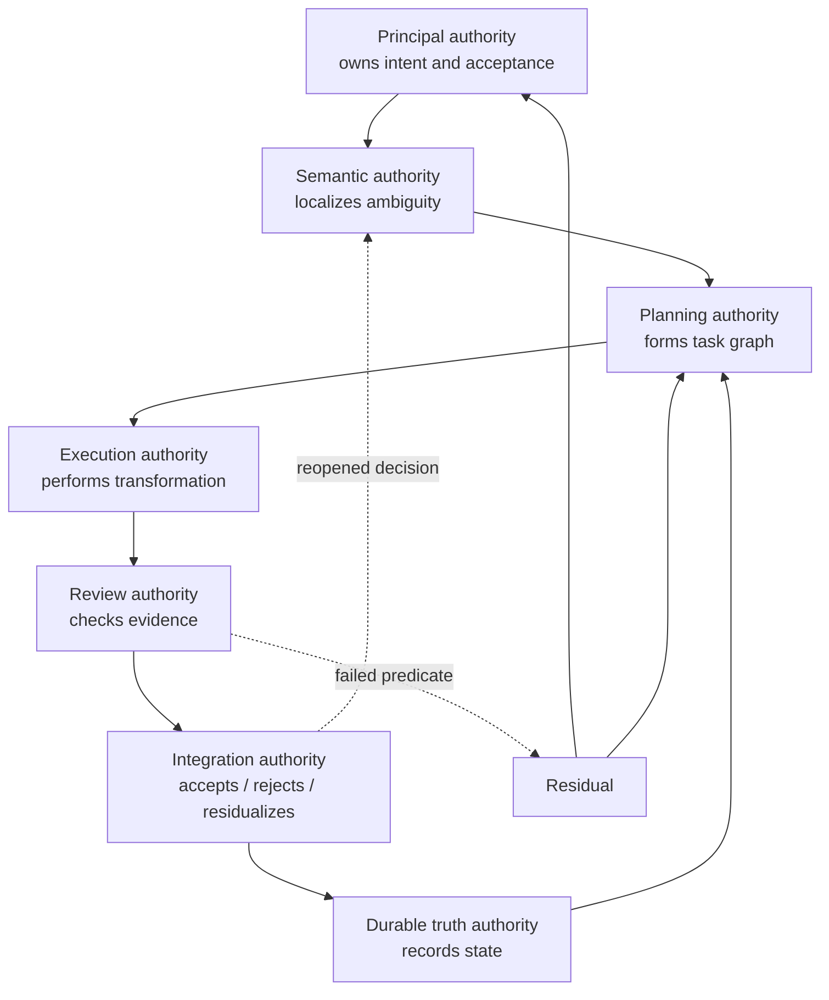

# narada.usc As A System

`narada.usc` is the executable implementation of the Universal Systems Constructor.

It takes principal intent plus constructor grammar, applies admissibility policies, validates construction artifacts, and generates USC-governed repositories or cycles. It does not execute the constructed system itself; generated repos may later compile toward Narada, GitHub issues, local task files, or other targets.

## Constructor Package Roles

## Generated Repo Shape

## Boundary

`narada.usc` constructs and validates governed construction artifacts. It does not replace a runtime. Narada is one future target for compiled operations; app repos may also target other execution systems.

## CLI Interaction

## Construction Artifact Lifecycle

## CIS Admissibility Path

## Compile Target Model

## Authority Loci In A Construction Cycle

